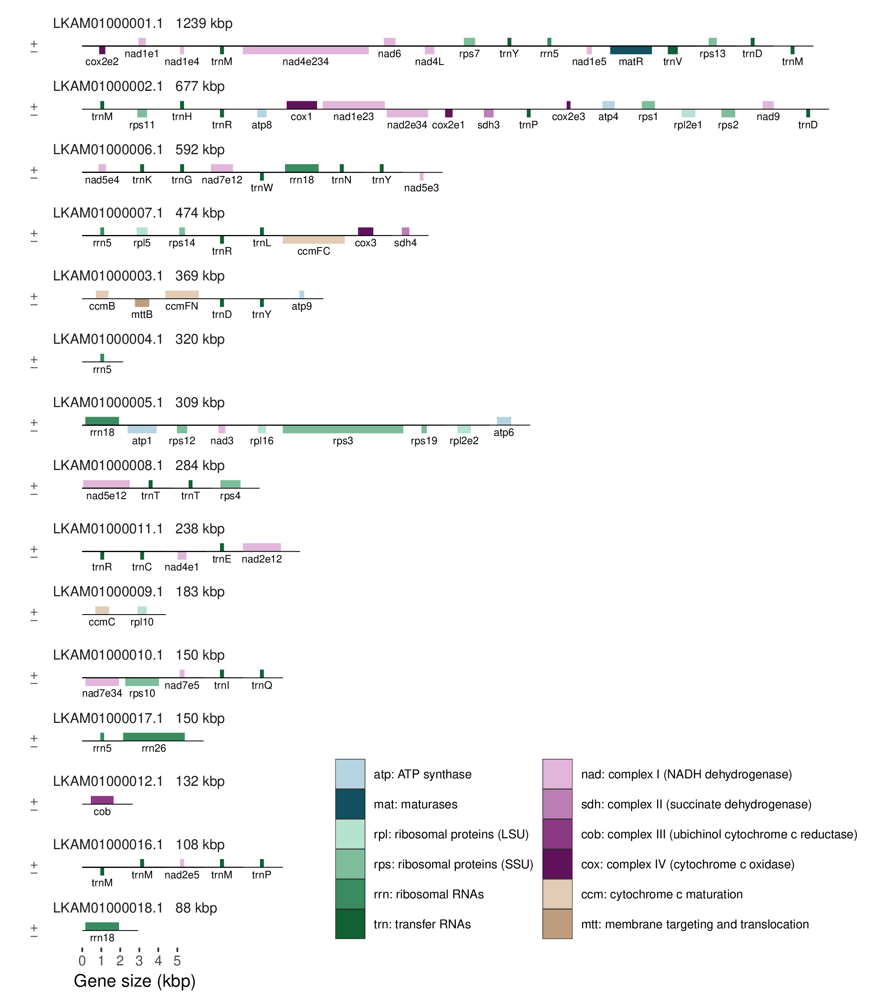

Annotate the mitochondrial genome of white spruce (Picea glauca)
================================================================================

+ [GFF](pg29mt-scaffolds.gff)

# Notes

- *ccmFC* is missing exon 2 of 3 due to an assembly gap
- *nad2* is missing exon 3 of 5 due to an assembly gap
- *nad5* is missing exon 5 of 5 due to an assembly gap

